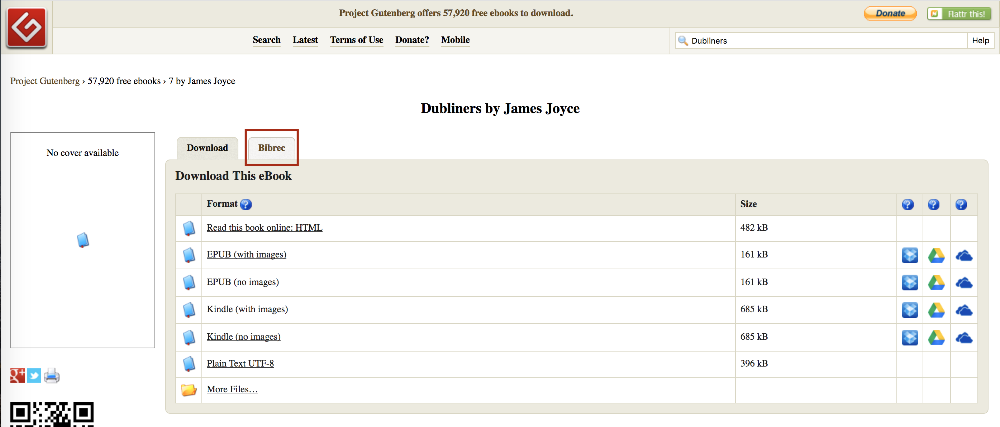
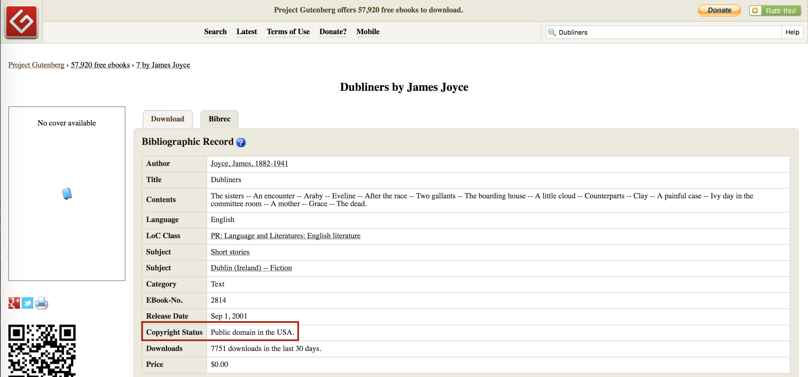

# Notes on Copyright 

This document should hopefully provide help with copyright law and the use of our two main 
repositories, Project Gutenberg and HathiTrust. The Summary should provide all the necessary 
information for 99.9% of cases, but some edge cases are explicated under "Finer points."

Let me know if you have any further questions at djwyen@mit.edu .

—Derek Yen, Copyright and License Specialist, Data Group

## Summary

* Books which are in the *Public Domain* are not subject to copyright. We can use books in the 
Public Domain without requesting special permissions.

* Any book **first published before 1923** is in the Public Domain in the United States.

* As we are working in the United States, we operate entirely within US copyright law. The above "published before 1923" rule is our 
biggest consideration. (*NB: There are some further details explained below, but this is the 
biggest rule.*)

* Project Gutenberg and HathiTrust are both based in the United States, so the bulk of their book
 uploads are in the Public Domain in the United States. (*See below for exceptions*)

## Finer points

#### U.S. Copyright Law

* Because any book first published before 1923 is in the Public Domain, any book which is still 
copyrighted cannot have been published before 1923. Because our study only examines books written
 from 1776-1922, **any book that is still copyrighted is not within our time period of interest and 
 not the subject of this study.** However, do note the following:

* Not all books in the Public Domain were first published 
between 1776-1922. Books can enter the Public Domain other ways, eg if  a book's author 
voluntarily enters it to the Public Domain. **There are books in the Public Domain which are not 
the subject of our study.**

* Additionally, pay attention to the exact book you are downloading. Some books may appear to be 
books which are within the public domain, but are not. For example, a publication of one of 
Shakespeare's plays (all in the public domain) could be itself not in the public domain if it 
contains copyrighted content, such as scholarly essays or annotations. This should not be 
relevant because scholarly annotations, essays, forewords, etc. are not themselves literature and
 should not be processed anyway, but this is an additional reason to ensure that scraped books 
 are actually just books.

 
#### Project Gutenberg

* Project Gutenberg is based in the US so the majority of their uploads are in the Public Domain 
in the US. There are some exceptions.

* Some works uploaded to Project Gutenberg are under copyright, but have been uploaded with 
permission. However, any book copyrighted cannot have been published before 1923, and is 
thereby outside the scope of our study anyway. **Do not use works that are still copyrighted.**

* Project Gutenberg does not provide the first publication date of works they've 
uploaded; this information must be obtained elsewhere. There are 
some books in the public domain that were not first published before 1923, so **do not use a book's 
copyright status to assume that it is within our search period.**

* Project Gutenberg provides info about the copyright status of works they've uploaded, which can
 be viewed under "Bibrec." See  below:
 
 
 
 
