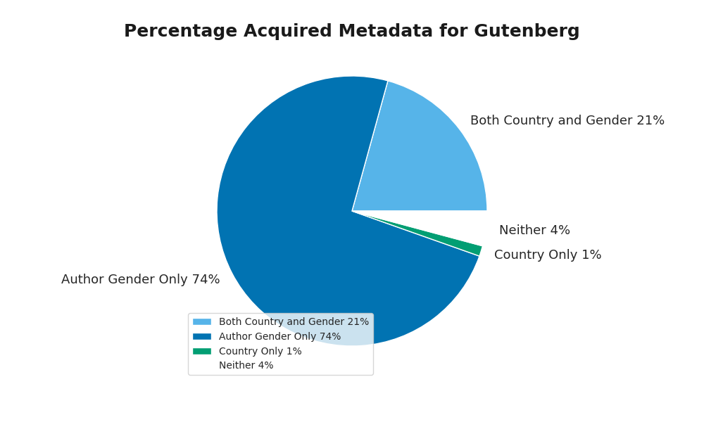

# Visualizations

## Countries of Publication

The code that generated “Country of Publication for Gutenberg” has a threshold for which 
countries are shown. Countries shown on the graph published greater than or equal to one percent 
of the total books used for this research. From this graph, it can be found that a majority of 
the books from the Gutenberg corpus were published in either the United States or the United 
Kingdom. This can be explained by the fact that the United States and United Kingdom have one of 
the highest concentration of English speakers. Additionally, Project Gutenberg was founded in the 
United States which may have an influence on the proportion of books from the United States.

## Publication Years

From the “Publication Year Concentration for Gutenberg” graph, there is an exponentially 
increasing frequency of books per year in the Gutenberg corpus from 1771 to 1921. As printing 
became cheaper over time, publishing became cheaper along with it, and this may explain the 
exponential growth. When printing was more expensive, only books that were deemed "publishing 
material" were published, and as it became cheaper, the standard for published material 
decreased, allowing for a wider range of books to be put into publication.

## Gender Breakdown

The gender breakdown is about two-thirds male which should be considered when looking at the 
analysis of the Gutenberg corpus.

## Success In Acquiring Metadata

It may have become apparent from looking at the previous charts that not all the books were 
necessarily included.  Any books for which a publication date could not be found were rejected 
from the corpus, so all the novels have associated publication dates.  However, this requirement 
was not imposed for author gender or country of publication.  Acquiring author gender was 
typically easier because it could be inferred from the names of the authors; but getting the 
country of publication required searching Wikidata, which means that many more obscure books have
 no countries of publication.  One should be aware that analyses based on country of publication 
 will only involve 22% of the corpus, or roughly 900 books.  [Read more about the metadata 
 acquisition here.](/info/metadata)
