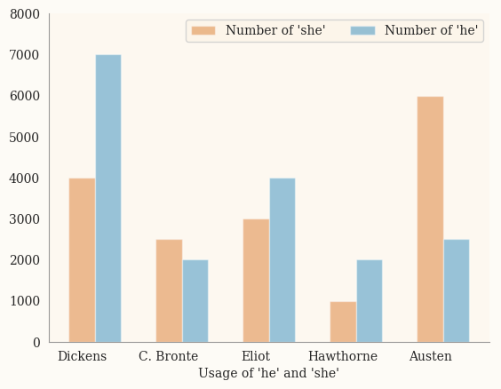

# Deployment Visualization

Research and development in visualization as connected to deployment for this project was concentrated in three main areas, which were:
- General principles for visualizations, particularly in connection to website design
- Specific visual choices for the gender novels project
- How to fulfill these principles in Python

## General Principles
Edward R. Tufte’s The Visual Display of Quantitative Information was a valuable resource when researching and developing principles for visualization. Some key ideas pulled from this book were the principles of using a visualizations to tell the story of the data used, maximizing the ratio of data conveyed to ink used, and choosing simple designs that don’t obfuscate information. Tufte’s book also had helpful examples of visualizations that did and did not satisfy these principles.
Another consideration that informed general principles was accessibility. It was important that visualizations be easily comprehensible by people with colorblindness and/or visual impairments. Therefore, visualizations needed to use a color scheme designed for colorblind people, not heavily rely on color differences for comprehension, and not have an overly busy design or small, hard-to-read elements.

## Specific Guidelines
These general principles were then used alongside stylistic considerations to develop specific guidelines for visualizations produced by the gender novels project. These guidelines included a palette chosen both for its ability to be easily understood by colorblind people and its connection to the gender novels project through its similarity to color schemes popular in the 19th century. A cream background color and serif font were similarly chosen for their balance between comprehensibility and 19th century aesthetics. Visualizations also used the Seaborn package, described below, to easily produce clean, simple, and comprehensible designs.

## Achieving these Principles
Matplotlib was used to make the base visualizations, as it is a powerful yet easily learned tool for making visualizations in Python. However, Matplotlib’s default style is not very attractive, and the aesthetics of Matplotlib visualizations are difficult to control. Therefore, the Seaborn package, which is designed to work with Matplotlib to produce more attractive visualizations, was also used. Seaborn methods were used to set the default style to something clean and simple; set font and background color; and find and implement an aesthetically pleasing, accessible palette.

The resulting code was used to produce plots in the style of this sample plot (produced with contrived data). 
