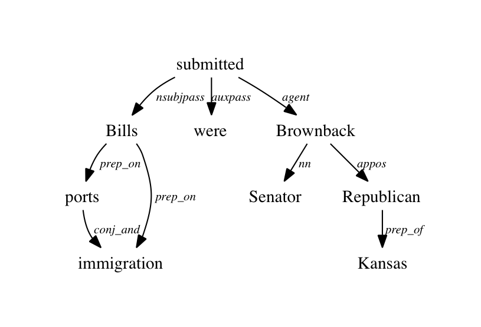

# Grammar Analysis

We implemented a function that outputs all the words that follow a specific keyword in a given 
novel. Then, these words are sorted by part of speech, which provides us with an opportunity to 
run analysis on the usage gendered pronouns as various parts of speech. We 
have also included a function that obtains the frequencies of several user-selected keywords.

The text of the novel has been processed so that only the sentences that contain gendered 
pronouns (he, him, his, she, her, hers) are considered. A syntactic dependency tree is produced for 
each of these sentences using the Natural Language Toolkit (NLTK). The dependency tree contains 
information about the relationships between pairs of words in the sentence, allowing us to 
analyse the novels on a deeper level by utilizing information not just from 
the individual words but also from the ways they are employed in the sentences. Here is an 
example of a dependency tree for the sentence _"Bills on ports and immigration were submitted by Senator Brownback, Republican of Kansas"_:

The information from the dependency tree was used to identify how many times male and female 
pronouns act as an agent (the "subject," or active noun in a sentence that does an action) in the 
sentence versus how many time they act as a patient (the "object," or passive noun in a sentence 
that is affected by an action).

Our analysis revealed that male pronouns serve as agents more frequently than female 
pronouns. For example, in Louisa May Alcott’s _Little Men: Life at Plumfield with Jo's Boys_, 
male pronouns appeared as an agent 1260 times and female pronouns appeared as an agent just 581 times.

The dependency trees were also used to extract the adjectives and the verbs that are used in 
tandem with female and male pronouns. The set of adjectives that are used with female pronouns 
vastly differs from the set of adjectives that are used with male pronouns.
