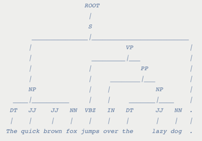

# Natural Language Processing

The lab used the Natural Language Toolkit (NLTK) in order to generate dependency parses of the 
novels. We wrote code to tokenize each novel into sentences which would then be fed into the 
dependency parser. Using the Stanford NLP parser, we generated dependency trees to illustrate the 
concrete relationships between each word in a sentence (nouns, verbs, adjectives, and other parts
of speech). For instance, here is a tree for the sentence “The quick brown fox jumps over the 
lazy dog” gives the following tree structure:

We can also create a list of dependency triples, which enumerates pairwise relationships between words (such as an adjective describing a noun):

- (('jumped', 'VBD'), 'nsubj', ('fox', 'NN'))
- (('fox', 'NN'), 'det', ('The', 'DT'))
- (('fox', 'NN'), 'amod', ('quick', 'JJ'))
- (('fox', 'NN'), 'amod', ('brown', 'JJ'))
- (('jumped', 'VBD'), 'nmod', ('dog', 'NN'))
- (('dog', 'NN'), 'case', ('over', 'IN'))
- (('dog', 'NN'), 'det', ('the', 'DT'))
- (('dog', 'NN'), 'amod', ('lazy', 'JJ'))

We have completed several main analyses using these dependency triples. First, we 
analyzed the relative frequency of male and female pronouns acting as agents (the subject) versus
as patients (the object). As one might expect, the analysis revealed that male pronouns serve as 
agents more frequently than female pronouns. For example, in Louisa May Alcott’s _Little Men: 
Life at Plumfield with Jo's Boys_, male pronouns appeared as an agent 1260 times and female 
pronouns appeared as an agent just 581 times. 

In addition, we have written code to compile a list of adjectives and verbs associated with 
female pronouns versus male pronouns. Using Dunning analysis, a statistical method to quantify 
similarity, this data can be used to determine the most “feminine” and “masculine” adjectives and
verbs.

The main challenge the lab faced was optimizing the code to run at reasonable rates, taking into 
consideration the corpus of over 4000 novels. Runtime and memory issues were the principal difficulties.
