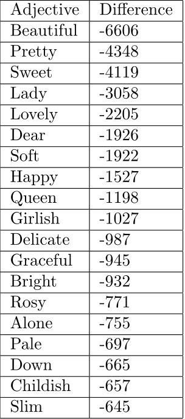
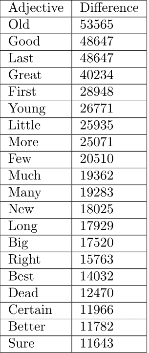

# Pronoun Adjective Usage

The code used for this analysis can be found in [pronoun\_adjective\_analysis.py](https://github.com/dhmit/gender_novels/blob/master/gender_novels/analysis/pronoun_adjective_analysis.py).

The raw analysis returns a dictionary with each novel mapped to an array of 2 dictionaries:
* Each adjective and its number of occurrences associated with male pronouns
* Each adjective and its number of occurrences associated with female pronouns
 
For each novel, this analysis is conducted by iterating through the novel's tokenized text and considering windows of 10 
words. When the central word of a window is a gendered pronoun, any adjectives also in the window are added to a dictionary.
If there are additionally any opposite-gendered pronouns also in the window then the adjectives are discarded (as they are 
technically associated with both gender pronouns in that case).

## Top 20 Adjectives Associated with Each Gender
**These were obtained by calculating the difference between adjective associations with male pronouns, and with female 
pronouns:** 
> number of male pronoun associations - number of female pronoun associations = difference value

Adjectives with the highest positive difference values demonstrate the strongest male pronoun association, and adjectives 
with the highest negative difference values demonstrate the strongest female pronoun association.
####Top 20 Adjectives Associated with Female Pronouns

#### Top 20 Adjectives Associated with Male Pronouns

