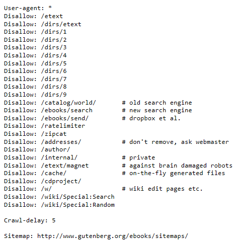

#Web Scraping
This is  the act of extracting data from websites either manually or automatically. The different methods have different pros and cons.

##Manual scraping
This means a user will manually visit a website, navigate to a specific file, download the file to a specific location and name the file. This process is very time consuming, however still has benefits. It requires little to no coding ability and is unlikely to violate any fair use laws in the contexts of downloading from publicly stored books. If only certain books are required, manual scraping allows for human filtering which in cases where the boundaries cannot be easily defined/written in code can be faster than automatic scraping. For a small set of data, this may be the optimal method considering the amount of people working on a project however for a larger set of data other methods should be used.

##Automatic scraping
Automatic scraping involves writing a code/script to download a series of files. Once written this method is much faster than manual scraping however has some significant drawbacks. While web scraping is not officially against American Law, some may see it as against the fair use policy to disobey the guidelines set out in the robot.txt file. The robot.txt file is a file that shows what types of robots are allowed to visit a website. Robots.txt follows the robots exclusion standard in order to ensure all users/scrapers can understand the file.

This is a screen shot of a part of the project Gutenberg robots.txt file. The line that says 
'user-agent: *' means the following rules apply to all robots. The file paths that end with '/' means that they include all subgroups within that website path.  This shows that project Gutenberg does not want to have its website scraped.

One of the main reasons why websites are against scraping as it causes a drain on the server. This means if scraping code is written to download books at intervals this may not create a problem for the website. Still, one should refer to the websites fair use policy and if possible contact the host.

Scraping against the will of a website can have negative repercussions. This could include 'crawler traps', hidden in the website so that algorithms get caught out when trying to scrape. There may also be an IP blocker, that will stop a certain IP from accessing the website. This would be a large problem as we wouldn't be able to do any scraping (including manual scraping) if this were to occur.

#Our Solution
One way to over come this issue is to use mirrors. Mirrors are static copies of the website stored elsewhere. Websites provide these to allow scraping without draining the main websites resources. Project Gutenberg has a number of mirrors which can be found at https://www.gutenberg.org/MIRRORS.ALL. 
Gutenberg also [provides a how-to on mirroring](https://www.gutenberg.org/wiki/Gutenberg:Mirroring_How-To) from there website. This includes a recommendation to use rsync so this is what we have chosen to use.
We used the mirror aleph.gutenberg.org.

When we first used rsync we predicted the file size to small. There where many more files on the 
server than we originally accounted for. Gutenberg includes images, sound files and multiple copies of the same book indifferent file formats. Even if we got rid of all the wrong file formats we would still have to deal with all the files that do not fulfill the projects requirements for processing. In the end we chose to filter out incorrect file types in our original rsync before then using Metadata to filter the files even further.

###References
https://softwareengineering.stackexchange.com/questions/180108/what-will-happen-if-i-dont-follow-robots-txt-while-crawling
https://softwareengineering.stackexchange.com/questions/180108/what-will-happen-if-i-dont-follow-robots-txt-while-crawling
https://www.gutenberg.org/robots.txt
https://en.wikipedia.org/wiki/Robots_exclusion_standard
