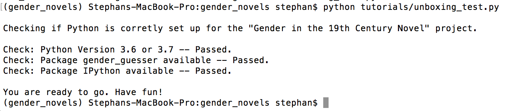

# Installing and Setting Up Git

We will use Git to work together on our shared codebase. Git is version-control open-source software that allows us to work on code individually while we test, document, and prepare new functions and features. Once we are ready to share the new additions to the larger project, we can open a pull request to receive feedback and modify our code until it is accepted and incorporated into the larger project's codebase.

GitHub is a popular code repository web-based hosting service web-based hosting service that uses Git to help developers collaborate on code. It offers a desktop program to help make Git more intuitive.

This guide will set you up with Git and GitHub on a Windows or Mac machine.

**Please note**: We can only provide technical support for Mac and Windows computers.

## Install Git

We will take you through installing Git for Windows or Mac. But first, you should check to see if you happen to have Git installed already. Open up a Terminal or PowerShell window and type the following command:

```
git --version
```

If Git is not installed, you will receive output that indicates that `git` is not a recognized command, and you should move on to installation below.

If you received a version number, then you do have Git installed, and you can move onto the **Set Up GitHub** section.

### Windows

You should have Chocolatey installed on your machine to manage packages. If you don't have Chocolatey installed, you can work through the Windows section of the [Python Installation guide](https://github.com/dhmit/gender_novels/blob/master/gender_novels/tutorials/python_install.md).

Running PowerShell as Administrator, type the following command:

```
choco install -y git
```

Git should be installed into your system. When installation is complete, you can move on to the **Set Up GitHub** section.

### Mac

On a local Macintosh computer, if you type a Git command into your Terminal window (as in `git --version` above), you’ll be prompted to install Git if it is not already on your system. When you receive this prompt, you should agree to have Git installed and follow the instructions and respond to the prompts in your Terminal window.

With this complete, you can move on to the **Set Up GitHub** section.

## Set Up GitHub

Next, you should create a [GitHub account](https://github.com/join)if you don't already have one.

It is worth noting that you can get added benefits through GitHub and other technology organizations — including unlimited private code repos — by signing up for the [Student Developer Pack.](https://education.github.com/pack)

#### Fork the Repository
The code and data for our gender novels project is held at
https://github.com/dhmit/gender_novels. To enable us all to work on the
project individually without interfering with someone else's work, we
will each create our own "fork" of the main project. We will cover
what forks, pushes, and pull requests are in more detail later.

For now, you just have to create your own fork of the main project.
To do this, you have to log in to your Github account and go to the
[main project page](https://github.com/dhmit/gender_novels). There, you
should look for the "Fork" button on the right side near the top.


Once the main repository is forked, you should be on a page that looks
almost like the original repository except that it doesn't belong to the
dhmit account but rather to your own account (in this case: dhmit-test).


#### Install GitHub Desktop
[Github Desktop](https://desktop.github.com/) gives you a GUI to work
with git and Github. The main advantage of the GUI over the command line
interface is thatit gives you an additional visual review of your
changes before you push code, so we ask that you use Github Desktop.

You can download [Github Desktop here.](https://desktop.github.com/)

#### Create a Local Copy of the Repository
Once you have installed and opened Github Desktop, you will be greeted
by a loading screen. To download a local copy of the repository that
you just forked, click on "Clone a Repository."


If you aren't already logged in to your Github account, you should sign
in now.


Signing in will connect Github Desktop to your Github account.
Logging in will drop you back on the loading screen--click on "Clone
a Repository again."

You should now see the forked repository pop up under "Your
Repositories." Once you click on it, you can select the local path where
you want all the project files to be stored.
Note this path down, we will need it again later. In my case, the path
was
```
/Users/stephan/code_repos/gender_novels
```
Once the path is set, hit "Clone."


If you go the specified path, you should now see all of the project
files there.


#### Change into the Directory of the gender_novels Repository
We're almost done. For the next steps, we need a shell window that
operates from the directory of our gender_novels repository.
Recall the local path for the gender_novels repository from above. We
now need to change into the directory of our repository by using the cd
(change directory) command
```console
(gender_novels) $ cd <local path to gender_novels repository>
```
In my case the path was /Users/stephan/code_repos/gender_novels, so the
command becomes
```console
(gender_novels) $ cd /Users/stephan/code_repos/gender_novels
```

#### Install Dependencies
In our project, we use other existing libraries to speed up our work.
Right now, the project already includes gender-guesser, a library that
helps us to automatically detect the gender of a character as well as
IPython, an interactive Python shell.

To install these packages as well as any other future dependencies,
you can run
```console
(gender_novels) $ pip install -r requirements.txt
```
If you get a "no such file or directory" error, you are most likely
in the wrong directory.


#### Final Step: Test the Installation
To test if you have the correct Python version as well as all of the
required libraries you should run unboxing.py in the
tutorials directory by running
```console
(gender_novels) $ python tutorials/setup_test.py
```
Running this script will tell you if your installation succeeded.



If all of the tests pass, you are ready to go. If not the script will
tell you what still needs to be fixed.

#### Final Step: Update the Repository

Before making any modifications to the code on your computer, it's
always a good idea to check if there are any updates to the codebase
on Github. This helps to avoid conflicts between your codebase and the
master codebase later on.

You can fetch the latest update with Github Desktop by clicking on
"Fetch Origin."


*This tutorial was based on [How To Contribute to Open Source: Getting Started with Git](https://www.digitalocean.com/community/tutorials/how-to-contribute-to-open-source-getting-started-with-git#installing-git-on-macos).
