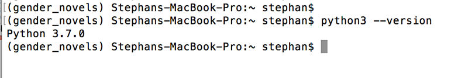
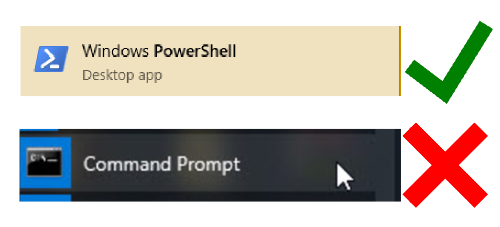

# Python Installation

This document will walk you through the process of installing Python to start working on projects in the MIT DH Lab.

**Please note**: We can only provide technical support for Mac and Windows computers.

## Install Python
Though many operating systems ship with a version of Python, we need to ensure that we're using the most up-to-date version available. We'll walk you through installation for both Mac and Windows computers via package managers.

You can check whether you have Python 3 already installed by opening a terminal window and typing:
(Note: if you don't know how to open a terminal, see below--the process is different for Macs and
Windows)

```
python3 --version
```
If that doesn't work, try:

```
python --version
```




If you receive an error or a version of Python lower than 3.6, you should continue to install for your operating system, by following the relevant section below.

### Windows Installation
Open Windows PowerShell, which you can do by right-clicking on the Start menu icon on the lower left-hand corner of your screen.

When the menu pops up, you should click on “Search,” then type “PowerShell” into the search bar.
**Do not use Command Prompt.**


Right-click on “Windows PowerShell,” the Desktop app.

Select `Run as Administrator.`

This is important: You need to use PowerShell, not the Command prompt.
When you are prompted with a dialogue box that asks *Do you want to allow this app to make changes to your PC?* click on **Yes**.

We can switch out of the system folder by typing the following command:

```
cd ~
```

Then we’ll be in a directory like `PS C:\Users\your-name`.

To continue with our installation process, we are going to set up some permissions. We're going to use the RemoteSigned execution policy to set the permission for the current user that allows the PowerShell to accept downloaded scripts that we trust without making the permissions as broad as they would be with an Unrestricted permission. In the PowerShell, let’s type:

```
Set-ExecutionPolicy -Scope CurrentUser
```

PowerShell will then prompt us to provide an execution policy, and since we want to use RemoteSigned, we’ll type:

```
RemoteSigned
```

It will give you a warning that you are changing your execution policy.  Click "Y" to save.

Next, we're going to install a package manager which will help us automate installation processes for Python and other tools. Chocolatey is a command-line package manager built for Windows that works like `apt-get` does on Linux. We can install it by typing the following:

```
iwr https://chocolatey.org/install.ps1 -UseBasicParsing | iex
```

With Chocolatey installed, we can download Python 3:

```
choco install -y python3
```

You’ll want to confirm that Python is installed and ready to go. Use the command `refreshenv` or **close and re-open PowerShell as an Administrator**, then check the version of Python available to you on your local machine:

```
python --version
```

With Python fully installed, we can move onto setting up a programming environment.

### Mac Installation

You can find the Mac Terminal by going into Finder, navigating to the Applications folder, and then into the Utilities folder. From here, double-click the Terminal like any other application to open it up. Alternatively, you can use Spotlight by holding down the command and spacebar keys to find Terminal by typing it out in the box that appears.

We need to first ensure that Xcode is installed in order to make use of macOS software development tools.

```
xcode-select -p
```

If you receive the following output, then Xcode is installed:

```
Output
/Library/Developer/CommandLineTools
If you received an error, then in your web browser install [Xcode from the App Store](https://itunes.apple.com/us/app/xcode/id497799835?mt=12&ign-mpt=uo%3D2) and accept the default options.
```

Once Xcode is installed, return to your Terminal window. Next, you’ll need to install Xcode’s separate Command Line Tools app, which you can do by typing:

```
xcode-select --install
```

At this point, Xcode and its Command Line Tools app are fully installed, and we are ready to install the package manager Homebrew.

A package manager is a collection of software tools that work to automate installation processes that include initial software installation, upgrading and configuring of software, and removing software as needed.

To install Homebrew, type this into your Terminal window:

```command
/usr/bin/ruby -e "$(curl -fsSL https://raw.githubusercontent.com/Homebrew/install/master/install)"
```

```
nano ~/.bash_profile
```

Once the file opens up in the Terminal window, write the following:

```
export PATH=/usr/local/bin:$PATH
```

To save your changes, hold down the control key and the letter o, and when prompted press the return key. Now you can exit nano by holding the control key and the letter x.

For these changes to activate, in the Terminal window, type:

```
source ~/.bash_profile
```

Once you have done this, the changes you have made to the `PATH` environment variable will be effective.

We can make sure that Homebrew was successfully installed by typing:

```
brew doctor
```

If no updates are required at this time, the Terminal output will read:

```
Your system is ready to brew.
```

Otherwise, you may get a warning to run another command such as `brew update` to ensure that your installation of Homebrew is up to date.

Once Homebrew is ready, you can install Python 3:

```
brew install python3
```

You can ensure that Python 3 is successfully installed by typing:

```
python3 --version
```

With Python 3 installed, you're ready to set up a virtual environment.

## Setting Up a Python Virtual Environment

A virtual environment isolates the libraries and tools that we use for our project from those we might use in other projects. Setting up a programming environment provides us with greater control over our Python projects and over how different versions of packages are handled. This is especially important when working with third-party packages.

You can set up as many Python programming environments as you would like. Each environment is basically a directory or folder in your computer that has a few scripts in it to make it act as an environment.

Choose which directory you would like to put your Python programming environments in, or create a new directory with mkdir, as in:

```
cd ~
mkdir Environments
cd Environments
```

From within this directory, you can create a virtual environment with venv. We'll use the name `my_env` in this tutorial, but you should use a virtual environment name that is meaningful for your project.

```
[Mac]
python3 -m venv my_env
```

```
[Windows]
python -m venv my_env
```

The final step is to activate the virtual environment. The commands for Mac and Windows machines are slightly different.

If you're using macOS, type the following into Terminal:

```
[Mac]
source my_env/bin/activate
```

If you're using Windows, type the following into PowerShell:

```
[Windows]
my_env\Scripts\activate
```

Whichever operating system you use, your shell window should now be prefixed with the name of your enviornment, like so:

```
(my_env) $
```

With Python fully set up, we can move onto installing and setting up Git.

*This tutorial was based on [How To Install Python 3 and Set Up a Local Programming Environment on Windows 10](https://www.digitalocean.com/community/tutorials/how-to-install-python-3-and-set-up-a-local-programming-environment-on-windows-10#step-5-%E2%80%94-setting-up-a-virtual-environment) and [How To Install Python 3 and Set Up a Local Programming Environment on macOS](https://www.digitalocean.com/community/tutorials/how-to-install-python-3-and-set-up-a-local-programming-environment-on-macos).*
