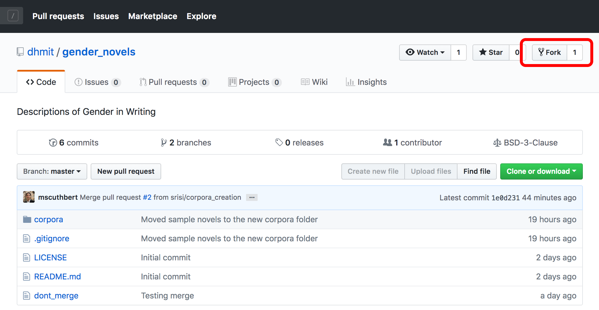
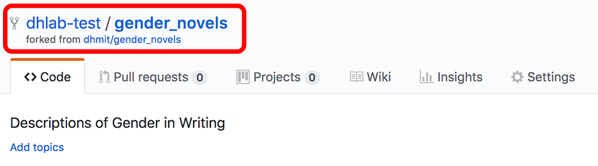
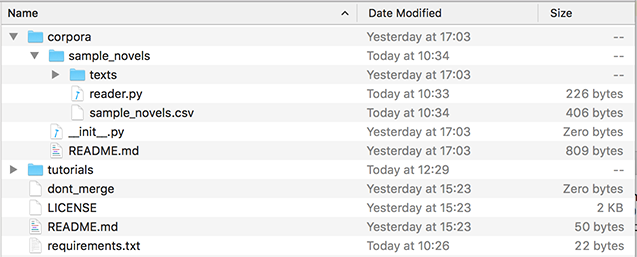

# Installing and Setting Up Git

We will use Git to work together on our shared codebase. Git is version-control open-source software that allows us to work on code individually while we test, document, and prepare new functions and features. Once we are ready to share the new additions to the larger project, we can open a pull request to receive feedback and modify our code until it is accepted and incorporated into the larger project's codebase.

GitHub is a popular code repository web-based hosting service web-based hosting service that uses Git to help developers collaborate on code. It offers a desktop program to help make Git more intuitive.

This guide will set you up with Git and GitHub on a Windows or Mac machine.

**Please note**: We can only provide technical support for Mac and Windows computers.

## Install Git

Please follow the relevant sections below for Windows or Mac installation. For more context on Git and open source, you can read [How To Contribute to Open Source: Getting Started with Git](https://www.digitalocean.com/community/tutorials/how-to-contribute-to-open-source-getting-started-with-git)

### Windows

Open up a PowerShell window and type the following command to check whether Git is installed:

```
git --version
```

If you receive output that indicates that `git` is not a recognized command, Git is not installed, so let's install it with the package manager Chocolatey.

You should have Chocolatey installed on your machine to manage packages. If you don't have Chocolatey installed, you can work through the Windows section of the [Python Installation guide](/setup_python_1.md).

Running PowerShell as Administrator, type the following command:

```
choco install -y git
```

Git should be installed into your system. When installation is complete, you can move on to the **Create a GitHub Account** section.

### Mac

Open up a Terminal window and type the following:

```
git --version
```

If Git is not already installed, you’ll be prompted to install it on your system. When you receive this prompt, you should agree to have Git installed and follow the instructions and respond to the prompts in your Terminal window.

With this complete, you can move on to the **Create a GitHub Account** section.

## Create a GitHub Account

Next, you should create a [GitHub account](https://github.com/join)if you don't already have one.

It is worth noting that you can get added benefits through GitHub and other technology organizations — including unlimited private code repos — by signing up for the [Student Developer Pack.](https://education.github.com/pack)

## Fork Repository

Forking a repository allows us to work on the project individually without interfering with someone else's work. Each individual team member should create their own fork of the main project.

To do this, choose the relevant repository of [MIT DH](https://github.com/dhmit).

From the repository you're working with, you can create your own fork of the main project. To do this, you have to log in to your Github account and go to the main project page. For example, for the `gender_novels` project, the main project page is
[https://github.com/dhmit/gender_novels](https://github.com/dhmit/gender_novels). From this page, you
should look for the **Fork** button on the right side near the top.



Once the main repository is forked, you should be on a page that looks almost like the original repository except that it doesn't belong to the **dhmit** account but rather to your own account (in this case: **dhmit-test**).



With your repository forked, you can move on to installing the GitHub desktop application.

## Install GitHub Desktop
[Github Desktop](https://desktop.github.com/) provides you with a graphical user interface (GUI) to work with git and GitHub. This provides you with a visual review of your changes before you push code.

You can download Github Desktop from [https://desktop.github.com/](https://desktop.github.com/). Install the appropriate version for your machine and follow the installation steps.

## Create a Local Copy of the Repository
Once you have installed and opened Github Desktop, you will be greeted by a loading screen. To download a local copy of the repository that you just forked, click on **Clone a Repository**.


If you aren't already logged in to your GitHub account, you should sign in now.


Signing in will connect GitHub Desktop to your GitHub account.

If you logged in at this point, you may be dropped back on the loading screen — click on **Clone a Repository** again.

You should now see the forked repository pop up under **Your Repositories**. Once you click on it, you can select the local path where you want all the project files to be stored.

You may have a path similar to the following:

```
/Users/your-name/GitHub/repo-name
```

Note the path, as you will need to know it later.

Once the path is set, press **Clone**.


If you go to the specified path, you should now see all of the project files there.



With your local copy in place, we can now install dependencies so that we're ready to go.

## Complete Programming Setup

Return to your Terminal or PowerShell window. Activate your Python programming environment from the [Python tutorial](`/1_python_install.md`).

You'll know your environment is active if you see the environment name in your prompt:

```
(my_env) $
```

Navigate to your local copy of the repository with the `cd` command. This may look something like this:

```
cd ~/<GitHub-repo-name-path>
```

Within that repository should be a Python script called `setup.py` that will install all of the dependencies you'll need to complete this project.

You should run this script to install your dependencies by typing the following (from within your programming environment!):

```
python setup.py develop
```

After running the above command, deactivate your environment:

```
deactivate
```

This will reset the environment. Let's re-enter the environment now with the `source` or `.` command. Note that your path will likely be different.

```
[Mac]
. ~/Environments/my_env/bin/activate
```

```
[Windows PowerShell]
~\Environments\my_env\Scripts\activate
```

Now run the following test:

```
python setup.py test
```

This will test, among other things, whether or not the installation of the
gender_novels package and our testing suite was successful. If everything worked,
it should return:

```
Ran <x> tests in <y>s

OK
```

If you get this output, you have successfully installed and set up git,
Github, and Github Desktop.

If you are installing all of the DH Lab software, you can now move on to
[install the PyCharm IDE.](https://github.com/dhmit/gender_novels/blob/master/gender_novels/tutorials/setup/3_pycharm_install_setup.md)

*This tutorial was based on [How To Contribute to Open Source: Getting Started with Git](https://www.digitalocean.com/community/tutorials/how-to-contribute-to-open-source-getting-started-with-git#installing-git-on-macos).*
